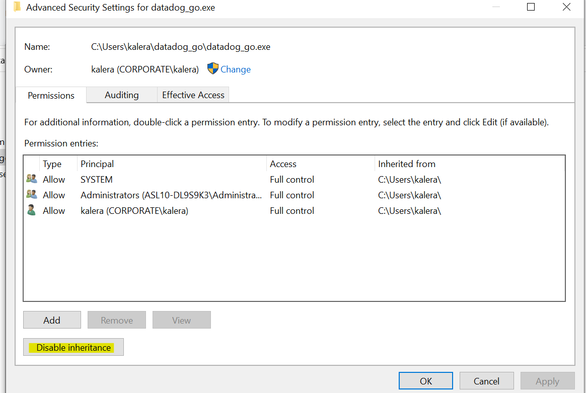
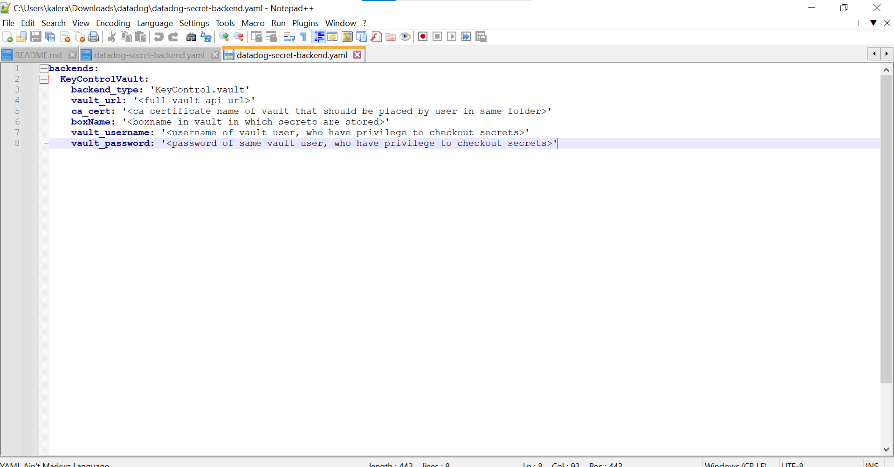

# DataDog executable file integration with KeyControl vault
## Introduction
 This document talks about functionality of DataDog executable file.
 Aim of an executable file is to able authenticate a user and fetch secrets from secrets vault 
 and return the output in a particular format to populate enviorment variable of DataDog(credentials in DataDog)

## Installation

step 1:  Download/paste datadog executable, datadog-secret-backend yaml file and ca certificate in same machine where datadog is present 

step 2: Update the executable to have the required permissions. Datadog agent expects the executable to only be used by the  ddagentuser for Windows

    Windows
    1) Right click on the "datadog-secret-backend.exe" and select "Properties".
    2) Click on the Security tab.
    3) Edit the permissions, disable permission inheritance, and then remove all existing permissions.
    4) Add read and execute to the "ddagentuser" and save your permissions.

## Configuration in datadog

step 1: open datadog.yaml file and look for variable and give path for executable file(datadog_go.exe)

    Standard

    secret_backend_command: <EXECUTABLE_PATH> 

    Example

    secret_backend_command: C:\Users\kalera\datadog_go\datadog_go.exe 

Step 2: Edit username and password that you want to fetch from keycontrol vault

    Standard

    user: "ENC[<secret-name-same-as-of-keyctrol-vault>]"
    password: "ENC[<secret-name-same-as-of-keyctrol-vault>]"
    
    Example

    user: "ENC[dbuser]"
    password: "ENC[dbpassword]"

## Configuration in datadog-keycontrol executable

step 1: Go to folder where executable is present and click on datadog-secret-backend.yaml

step 2: change the value variable according to vault and save it (warnings: do not change spaces and variable name only change value in between this ' ' only) 

    1) vault_url:- full vault api url
    2) ca_cert:- ca certificate name of vault that should be placed by user in same folder
    3) boxName:- boxname in vault in which secrets are stored 
    4) vault_username :- username of vault user, who have privilege to checkout secrets
    5) vault_password :- password of same vault user, who have privilege to checkout secrets

## Requirements

1) datadog-keycontrol executable 

2) ca cert of vault

3) datadog-secret-backend yaml file for configuration 

## Reference

1) [datadog secret managment](https://docs.datadoghq.com/agent/guide/secrets-management/?tab=linux)

2) [secret vault](https://entrustdatacardcorp.sharepoint.com/sites/HyTrust-Engineering/_layouts/15/stream.aspx?id=%2Fsites%2FHyTrust%2DEngineering%2FShared%20Documents%2FEngineering%2FHTDC%2FQA%2F10%2E0%20HTDC%2FSV%5FVersion10%5FDemo%2Emp4&referrer=Teams%2ETEAMS%2DELECTRON&referrerScenario=p2p%5Fns%2Dbim&ga=1)

## Video illustration of the above steps

1) [demo](https://entrustdatacardcorp-my.sharepoint.com/personal/aakash_kaler_entrust_com/_layouts/15/stream.aspx?id=%2Fpersonal%2Faakash%5Fkaler%5Fentrust%5Fcom%2FDocuments%2FScreen%20Recording%201%2Ewebm&ga=1)
